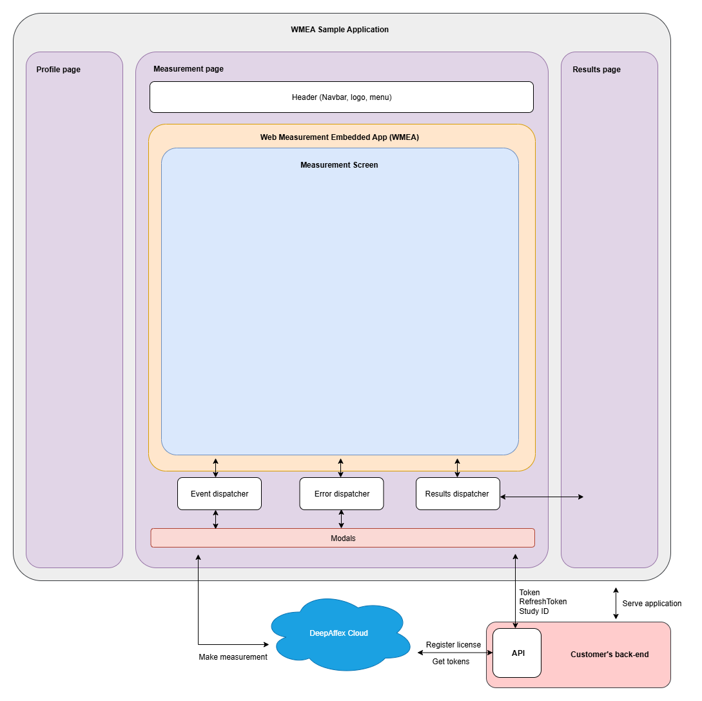

# Web Measurement Embedded App – Sample Applications



This repository contains two fully self-contained examples of the Web Measurement Embedded App (WMEA). Each folder includes everything needed to run independently—source code, server, dependencies, environment templates, and documentation.

## Sample Applications

- **`react/`** – Full-featured React SPA with (mock) authentication, demographic capture, measurement workflow, and results dashboard. Includes Rollup build pipeline and Express proxy server. See `react/README.md` for details.

- **`cdn/`** – Minimal static example that loads the WMEA widget directly from the CDN. Includes a lightweight Express server for token exchange. See `cdn/README.md` for details.


## Getting Started

1. Clone the repository
2. Choose which sample you want to run (`react/` or `cdn/`)
3. Navigate to that folder and follow its README for:
   - Environment variable setup (both use `.dev.env.example` and `.prod.env.example`)
   - Dependency installation
   - Development and production workflows

## Common Configuration

Both samples require DeepAffex API credentials configured via environment files:

- `API_URL` – DeepAffex API hostname (e.g., `api.na-east.deepaffex.ai`)
- `STUDY_ID` – Study identifier from DeepAffex portal
- `LICENSE_KEY` – License key registered for your study

Each sample folder contains `.dev.env.example` and `.prod.env.example` templates—copy and populate them with your credentials.

## SDK Region Handling

When `apiUrl` is omitted during WMEA widget initialization, the SDK automatically derives the region from the authentication token. This ensures the frontend stays aligned with your backend license region and is recommended for most deployments.

If you set `apiUrl` explicitly, you're responsible for ensuring it matches regulatory and latency requirements. Measurements are always stored in the token's region; computation occurs wherever the frontend communicates.

## Browserslist reminder

Check which browsers your current targets include with:

```bash
npx browserslist
```

Update the `browserslist` entry in `package.json` to adjust support levels. For example:

```json
"browserslist": [
  "Safari >= 18",
  "last 3 versions"
]
```

`Safari >= 18` removes unsupported legacy Safari releases, while `last 3 versions` covers the latest stable Chrome, Edge, and Firefox channels.
